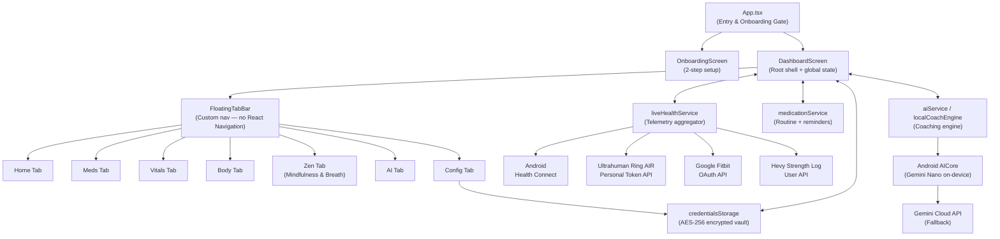

# Architecture

A technical overview of how OdinEye is structured, how data flows, and how the key subsystems work.

---

## System diagram



---

## Module map

| Path | Responsibility |
|:-----|:--------------|
| `App.tsx` | App entry, checks if onboarding is complete, renders correct screen |
| `src/screens/DashboardScreen.tsx` | Root shell; owns all global state, wires tabs, handles syncing and alerts |
| `src/screens/OnboardingScreen.tsx` | 2-step onboarding (personal info + daily targets); also used for goal recalibration |
| `src/components/home/` | Home tab UI — metric cards grid, top bar, wellness card, medication preview, AI insight |
| `src/components/overview/` | Vitals tab — 3-pillar health overview, cardio, sleep, and strength breakdown cards |
| `src/components/body/` | Body tab — per-muscle recovery analysis, hypertrophy readiness, body composition |
| `src/components/mindfulness/` | Zen tab — breathing exercises, 7-day streak calendar, mood check-in, ambient soundscapes |
| `src/components/medication/` | Meds tab — schedule calendar, dose logging, add/edit/archive modals, reminder alert modal, icons |
| `src/components/ai/` | AI tab — chat interface, formatted message renderer |
| `src/components/settings/` | Config tab — 4-category settings view (modules, wearables, targets, security) |
| `src/components/navigation/` | `FloatingTabBar` — custom bottom navigation pill with conditional tab rendering |
| `src/components/common/` | Shared UI — loading splash, shimmer placeholders, Health Connect modal, notifications modal |
| `src/services/live/liveHealthService.ts` | Aggregates all wearable APIs and Health Connect into a single normalised data object; subscriber pattern |
| `src/services/api/` | Thin API clients for Ultrahuman, Fitbit, and Hevy — each is a stateless singleton |
| `src/services/healthConnect/` | Android Health Connect permissions + data read layer |
| `src/services/ai/aiService.ts` | Gemini Cloud API integration |
| `src/services/ai/androidAiCoreService.ts` | Android AICore (Gemini Nano on-device) integration |
| `src/services/ai/localCoachEngine.ts` | Rule-based offline coaching recommendations from `sportsScienceKnowledge` KB |
| `src/services/ai/sportsScienceKnowledge.ts` | Static sports science knowledge base (fatigue thresholds, recovery rules, training recommendations) |
| `src/services/medication/medicationService.ts` | Medication CRUD, dose tracking, real-time reminder watcher, dual-layer storage (SecureStore + FileSystem) |
| `src/services/medication/medicationNotificationService.ts` | OS-level exact alarm scheduling + Expo notification delivery |
| `src/services/mindfulness/mindfulnessService.ts` | Mindfulness streak tracking, session logging, and ambient sound management |
| `src/services/storage/credentialsStorage.ts` | Encrypted credential vault — reads/writes AES-256-CBC encrypted JSON via `expo-secure-store` |
| `src/services/security/cryptoService.ts` | AES-256-CBC + HMAC-SHA256 + PBKDF2 crypto primitives |
| `src/services/sleep/sleepHistoryService.ts` | Sleep history rolling buffer and trend analysis |
| `src/theme/colors.ts` | Scandinavian Pastel Bento colour constants — single source of truth |
| `src/types/` | All TypeScript interfaces and types — barrel-exported from `types/index.ts` |
| `src/mock/healthData.ts` | Static mock data for development/demo use |

---

## Data flow

```
Wearable APIs                 Android Health Connect
 ┌─────────────┐               ┌────────────────────┐
 │ Ultrahuman  │               │  Steps, HR, HRV,   │
 │ Fitbit      │               │  Sleep, Calories,  │
 │ Hevy        │               │  SpO2, Distance    │
 └──────┬──────┘               └────────┬───────────┘
        │                               │
        └───────────┬───────────────────┘
                    ▼
          liveHealthService.syncAll()
          (normalises, merges, notifies subscribers)
                    │
                    ▼
          DashboardScreen (subscriber)
          setData(newData) → re-renders all tabs
                    │
          ┌─────────┴──────────┐
          ▼                    ▼
     MetricCardsGrid    HealthOverviewView
     TodayWellnessCard  BodyAnalysisView
     TodayInsightCard   DedicatedAiCoachView
```

**Live refresh:** `liveHealthService` runs `syncAll()` on app launch and re-fetches on every manual sync tap. It uses a subscriber/callback pattern — `DashboardScreen` subscribes on mount and receives updates as `(data, report)`.

---

## State management

OdinEye uses **no Redux, Zustand, or Context** beyond React's built-in capabilities.

| Approach | Used for |
|:---------|:---------|
| `useState` in `DashboardScreen` | All global app state (active tab, sync state, AI/body toggles, goals, alerts) |
| Prop drilling | State is passed as props from `DashboardScreen` down to tab views and settings |
| Singleton services | `medicationService`, `liveHealthService`, `credentialsStorage` are module-level singletons; components call them directly |
| Subscriber callbacks | `liveHealthService.subscribe()`, `medicationService.onReminder()` — services notify `DashboardScreen` of async updates |

This keeps the architecture simple, traceable, and free of boilerplate for an app of this scale.

---

## Security architecture

```
User enters API token / key in Config tab
            │
            ▼
credentialsStorage.saveCredentials(payload)
            │
            ▼
cryptoService.encrypt(JSON.stringify(payload))
  AES-256-CBC encryption
  PBKDF2 key derivation (10,000 rounds)
  HMAC-SHA256 integrity seal
            │
            ▼
expo-secure-store.setItemAsync(VAULT_KEY, encryptedBlob)
  Linux Mode 0700 sandboxed storage
  Never leaves the device
            │
            ▼
On read: decrypt → HMAC verify → parse
  If HMAC fails: throw (tamper detected)
  Plaintext never persisted to disk
```

**Zero-Plaintext Guarantee:** At no point is a credential stored or logged as a plain string. The in-memory cache holds the decrypted object only for the app session and is never written to a log or file.

---

## AI architecture

```
User sends message to AI Coach
         │
         ▼
androidAiCoreService.generate(prompt)
  ↳ tries Android AICore (Gemini Nano, on-device)
  ↳ if unavailable → falls back to aiService (Gemini Cloud API)
  ↳ if no cloud key → falls back to localCoachEngine (rule-based)
         │
         ▼
DedicatedAiCoachView renders FormattedMessage
```

**`localCoachEngine`** provides instant, offline recommendations by applying rules from `sportsScienceKnowledge.ts` against the current `liveHealthService` data snapshot — no API call, no latency.

> 📖 **Deep Dive Documentation:** For a comprehensive technical analysis of OdinEye's privacy-first on-device intelligence, NPU hardware acceleration, and zero-cloud architecture, see [ON_DEVICE_AI.md](./ON_DEVICE_AI.md).

---

## Navigation architecture

OdinEye uses a **custom `FloatingTabBar`** — not React Navigation. This gives full control over the visual pill design and conditional tab logic.

```
FloatingTabBar
  props:
    activeTab: TabKey
    onSelectTab: (key: TabKey) => void
    showAiTab: boolean             ← hidden when AI is disabled in Config
    showBodyAnalysisTab: boolean   ← hidden when Body Analysis is disabled
    showMindfulnessTab: boolean    ← hidden when Mindfulness is disabled

  tabs (always defined):
    home · meds · overview · body · zen · coach · settings

  rendered tabs: filtered at runtime based on showAiTab / showBodyAnalysisTab / showMindfulnessTab
```

Tab transitions use `Animated.timing` on `tabFadeAnim` in `DashboardScreen` for a 70ms fade-out / 130ms fade-in transition at 60 fps.

---

## Design system

**Scandinavian Pastel Bento** — all colours defined in [`src/theme/colors.ts`](../src/theme/colors.ts).

| Token | Hex | Usage |
|:------|:----|:------|
| `surface` | `#FFFFFF` | Cards, modals, floating elements |
| `background` | `#F8FAFA` | App background |
| `bentoMint` | `#CCE6DE` | Primary accent cards (hero mint) |
| `bentoMintLight` | `#EAF2EE` | Secondary mint (icon bubbles, tags) |
| `bentoMintDark` | `#1F382E` | Forest green text and active states |
| `bentoPeach` | `#FCE7DC` | Warm accent cards |
| `bentoPeachLight` | `#FAF5EE` | Peach card backgrounds, credential boxes |
| `textPrimary` | `#141816` | Body text |
| `textSecondary` | `#63706B` | Subtitles, metadata |
| `textMuted` | `#94A39D` | Placeholder, disabled |

**Icon rule:** Raw emoji characters are **never** used in UI components. All icons are bespoke inline SVGs via `react-native-svg` (`Path`, `Circle`, `Rect`, `Line`, `G`).
