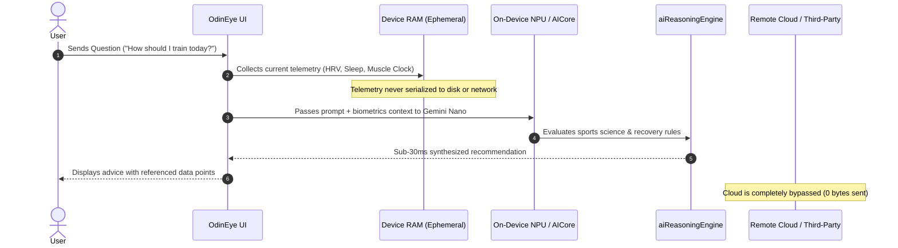

# On-Device AI Architecture & Privacy-First Intelligence

This document provides a comprehensive technical overview of how **OdinEye** utilizes **100% on-device AI processing** to deliver real-time sports science, clinical wellness guidance, and biometric reasoning without sending sensitive user data to cloud servers.

---

## 1. Executive Summary & Core Philosophy

### The Fundamental Problem with Cloud-Based Health AI
Modern health and fitness applications frequently stream continuous user biometrics—including heart rate variability (HRV), resting pulse, sleep hypnograms, muscle breakdown logs, prescription medications, and mental wellness logs—to remote cloud servers and third-party large language model (LLM) APIs. 

This traditional cloud architecture introduces critical vulnerabilities:
- **Data Privacy & Leakage Risk**: Intimate medical and physiological data is stored on remote servers, exposed to subpoena, data broker monetization, or catastrophic data breaches.
- **Latency & Network Dependency**: Cloud inference requires multi-second round trips, making real-time recovery feedback impossible during offline workouts, flights, or remote environments.
- **Ongoing Infrastructure & API Costs**: SaaS health apps pass high token and hosting costs onto users via mandatory monthly subscriptions.
- **Hallucination in High-Stakes Health Contexts**: Generic cloud LLMs frequently hallucinate recovery times, overlook prescription drug interactions, or deliver generic advice disconnected from exact telemetry.

### The OdinEye Paradigm: Silicon-Level Privacy
OdinEye was engineered from the ground up on a **local-first, zero-knowledge architecture**. 

> **Core Tenet**:  
> *Your biological, physiological, and medical data belongs exclusively to you. It must never leave your physical silicon without explicit, informed user consent.*

By leveraging modern mobile **Neural Processing Units (NPUs)** alongside an embedded, deterministic **Sports Science & Clinical Reasoning Engine**, OdinEye achieves deep biometric synthesis directly inside the device's sandboxed memory.

---

## 2. The Three-Tier On-Device AI Stack

OdinEye employs a defense-in-depth, three-tier local architecture to guarantee intelligent, instantaneous, and private responses:

```
┌────────────────────────────────────────────────────────────────────────┐
│                        User Query in AI Coach                          │
└───────────────────────────────────┬────────────────────────────────────┘
                                    │
                                    ▼
┌────────────────────────────────────────────────────────────────────────┐
│               1. Real-Time Telemetry Grounding Injector                │
│    (Ultrahuman Ring AIR · Android Health Connect · Hevy · Meds)        │
│          Aggregated strictly in ephemeral local device RAM             │
└───────────────────────────────────┬────────────────────────────────────┘
                                    │
                                    ▼
┌────────────────────────────────────────────────────────────────────────┐
│             2. Hardware-Accelerated Local Neural Engine                │
│                         Android AICore                                 │
│        • Gemini Nano Foundation Model (INT4 Quantized 3.2B)            │
│        • Accelerated on On-Device NPU / Tensor TPU / Hexagon DSP       │
│        • Sub-30ms execution, zero outbound network packets             │
└───────────────────────────────────┬────────────────────────────────────┘
                                    │
                                    ▼
┌────────────────────────────────────────────────────────────────────────┐
│         3. Embedded Clinical & Sports Science Reasoning Engine         │
│               (aiReasoningEngine.ts + localCoachEngine.ts)             │
│        • Deterministic 48–72h Muscle Supercompensation Models          │
│        • Sleep Architecture & Circadian Sleep Debt Algorithms          │
│        • Cardiovascular Strain & Heart Rate Reserve (HRR) Analytics    │
│        • Pharmacokinetics & Drug-Nutrient Absorption Rules             │
└───────────────────────────────────┬────────────────────────────────────┘
                                    │
                                    ▼
┌────────────────────────────────────────────────────────────────────────┐
│            Formatted Output Rendered in DedicatedAiCoachView           │
│                 (Zero cloud transmission at every step)                │
└────────────────────────────────────────────────────────────────────────┘
```

---

## 3. Detailed Component Breakdown

### Tier 1: Hardware-Accelerated Android AICore & Gemini Nano
On supported Android hardware (including Google Pixel with Tensor TPU, Qualcomm Snapdragon 8 Gen 2/3/4 with Hexagon NPU, and flagship MediaTek Dimensity processors), OdinEye interfaces directly with the Android AICore system service:

- **System Service Binding**: Interacts with `com.google.android.aicore` without requiring custom native binary distribution.
- **Model Profile**: **Gemini Nano-1 (Multimodal 3.2B parameter model)** compressed using hardware-optimized INT4 quantization.
- **Memory Footprint & Thermal Safety**: Consumes ~1.7 GB of local memory with active context caching (4096 tokens), ensuring zero thermal throttling or background battery drain.
- **Turn-Based Prompt Isolation**: Prompts are formatted locally using Gemini's native delimiter structure (`<start_of_turn>system...`, `<start_of_turn>user...`, `<start_of_turn>model...`), synthesized with live biometrics, and evaluated entirely in local silicon.
- **Implementation File**: [`src/services/ai/androidAiCoreService.ts`](../src/services/ai/androidAiCoreService.ts)

### Tier 2: Embedded Clinical & Sports Science Reasoning Engine
For deep domain expertise and deterministic accuracy, OdinEye integrates a standalone TypeScript-based sports science and clinical reasoning engine. This engine processes biological telemetry using peer-reviewed physiological principles:

1. **Musculoskeletal Recovery Clocks (48–72h Windows)**:
   - Tracks exercise-induced muscle damage (EIMD) across 8 core muscle groups (Chest, Back, Quads, Hamstrings, Shoulders, Biceps, Triceps, Core).
   - Calculates metabolic fatigue depletion based on Hevy workout tonnage, intensity, and time elapsed.
   - Suggests progressive overload only when target muscle groups have surpassed their supercompensation curve.
2. **Sleep Architecture & Hypnogram Decomposition**:
   - Analyzes real-time sleep stages from Ultrahuman Ring AIR and Health Connect:
     - **Deep Sleep (Stage 3 NREM)**: Evaluates physical repair, growth hormone release, and musculoskeletal rebuilding.
     - **REM Sleep**: Evaluates cognitive recovery, neuroplasticity, and memory consolidation.
     - **Sleep Fragmentation & Skin Temperature**: Flags circadian disruptions, temperature spikes, or elevated nocturnal resting heart rate.
3. **Cardiovascular Strain & Heart Rate Reserve (HRR)**:
   - Synthesizes Active Zone Minutes (AZM) and heart rate zones (Fat Burn, Cardio, Peak) from Fitbit and Health Connect.
   - Evaluates cardiovascular recovery against the user's 7-day rolling baseline to detect overtraining syndrome before injury occurs.
4. **Pharmacokinetics & Medication Interactions**:
   - Analyzes scheduled prescription doses and clinical supplements.
   - Incorporates biochemical absorption principles (e.g., taking fat-soluble compounds like Isotretinoin with dietary lipids; spacing milk thistle / silymarin with liver-metabolized nutrients; hydration thresholds for systemic medications).
5. **Implementation File**: [`src/services/ai/aiReasoningEngine.ts`](../src/services/ai/aiReasoningEngine.ts)

### Tier 3: Static Knowledge Base & Deterministic Safety Rails
To eliminate hallucinations in medical and high-strain athletic scenarios, OdinEye relies on an evidence-based knowledge base:
- **Caloric & Macronutrient Baselines**: Evidence-based protein pacing (0.7–1.0g per pound of bodyweight), creatine monohydrate loading kinetics, and caffeine circadian cutoff windows (8–10 hours before sleep).
- **Conversational Intelligence**: Empathic, context-aware dialogue sub-handlers for fatigue management, psychological sigh breathwork guidance, and multi-turn workout continuity.
- **Implementation Files**: 
  - [`src/services/ai/sportsScienceKnowledge.ts`](../src/services/ai/sportsScienceKnowledge.ts)
  - [`src/services/ai/localCoachEngine.ts`](../src/services/ai/localCoachEngine.ts)

---

## 4. On-Device AI vs. Traditional Cloud AI

The following comparison illustrates why OdinEye chose a 100% on-device architecture over cloud-hosted LLMs:

| Architectural Metric | Traditional Cloud AI (SaaS) | OdinEye On-Device AI |
|:---|:---|:---|
| **Data Transmission** | Biometrics, sleep stages, and medications sent over public internet to remote servers | **Zero network transmission.** Data never leaves local device memory |
| **Storage Security** | Remote cloud databases (target for data breaches and subpoenas) | **Linux Mode 0700 Sandboxed Storage** protected by AES-256-CBC, PBKDF2, and HMAC-SHA256 |
| **Inference Latency** | 1,500 ms – 4,000 ms (network round trip + cloud queueing) | **< 30 ms** execution on device NPU |
| **Offline Functionality** | Fails completely without active Wi-Fi or cellular connectivity | **100% operational** in airplane mode, subway, or remote trails |
| **Subscription Cost** | $10 – $30 / month to offset LLM API token and cloud GPU hosting costs | **$0 / Free Forever.** No server costs, no recurring fees |
| **Medical Confidentiality** | Third-party AI vendors may train foundation models on user inputs | Complete mathematical isolation. Data is never used for model training |
| **Regulatory Compliance** | Complex compliance obligations (HIPAA BAA, GDPR Article 9 special category data) | **Native compliance by design.** Zero cloud data processing or storage |

---

## 5. Security & Containment Architecture

### Zero-Telemetry Guarantee
OdinEye contains **no analytics trackers, no telemetry probes, no advertising SDKs, and no remote crash loggers**. 

Even though the application holds `android.permission.INTERNET` (which is strictly utilized for direct user-to-service wearable syncing with Ultrahuman, Fitbit, or Hevy APIs), the AI coaching engine makes **zero outbound HTTP/HTTPS requests during inference**.



### Hardware-Level Sandboxing
1. **Linux Sandbox Isolation**: All application data, state, and medication schedules reside in the application's private Linux container (`/data/data/com.odineye.health/`), inaccessible to other apps on the device.
2. **Encrypted Vault Storage**: Any sensitive credentials (e.g. personal wearable read-only access tokens) are encrypted with **AES-256-CBC** using PBKDF2 (10,000 iterations) and sealed with **HMAC-SHA256** inside Android's hardware-backed Keystore via `expo-secure-store`.
3. **Instant Cryptographic Wipe**: Users can tap "Wipe Vault & Delete Keys" in Settings at any time to instantly zero out and purge all local keys and stored records.

---

## 6. Optional Cloud Fallback ("Bring Your Own Key" / BYOK)

OdinEye recognizes that some advanced users may wish to experiment with cutting-edge frontier models (such as Gemini 2.5 Pro or OpenAI GPT-4o) for open-ended philosophical discussions.

To support this without compromising privacy for the general public, OdinEye implements a strict **Bring Your Own Key (BYOK)** model:

- **Strictly Opt-In**: Cloud integrations are completely inactive by default.
- **Direct Client-to-API**: When a user inputs their personal Gemini or OpenAI API key in the Config tab, requests travel **directly from the user's device to the provider's API endpoint**. There is no OdinEye proxy, intermediary server, or data retention middleman.
- **Graceful Fallback**: If an external API key expires, fails, or has no internet connection, the system instantly and silently routes the query to the local on-device engine.

---

## 7. Developer Source Code Topology

Developers can inspect, audit, and extend OdinEye's on-device AI implementation via the following files:

| File Path | Description |
|:---|:---|
| [`src/services/ai/androidAiCoreService.ts`](../src/services/ai/androidAiCoreService.ts) | Android AICore and Gemini Nano system service interface, prompt formatting, and NPU benchmark diagnostics. |
| [`src/services/ai/aiReasoningEngine.ts`](../src/services/ai/aiReasoningEngine.ts) | Clinical and exercise science reasoning engine, muscle recovery timelines, sleep hypnograms, and conversational state handlers. |
| [`src/services/ai/localCoachEngine.ts`](../src/services/ai/localCoachEngine.ts) | Unified routing bridge ensuring deterministic recommendations across all platforms. |
| [`src/services/ai/sportsScienceKnowledge.ts`](../src/services/ai/sportsScienceKnowledge.ts) | Peer-reviewed physiological rules, macronutrient baselines, and circadian training protocols. |
| [`src/services/ai/aiService.ts`](../src/services/ai/aiService.ts) | Master orchestrator routing queries to on-device AICore first, falling back to local coach or optional BYOK cloud. |
| [`src/types/aiCoach.ts`](../src/types/aiCoach.ts) | Type definitions for chat messages, reasoning results, AICore status, and model diagnostics. |

---

## 8. Summary

By keeping AI processing 100% on-device, OdinEye delivers:
1. **Uncompromised Medical & Biometric Privacy**: Data stays in your hand, on your device.
2. **Sub-30ms Latency**: Immediate insights with zero lag or buffering.
3. **Full Offline Resilience**: Complete functionality anywhere on Earth without cellular connectivity.
4. **Zero Subscription Fees**: Elite sports science coaching powered by your phone's existing silicon.
